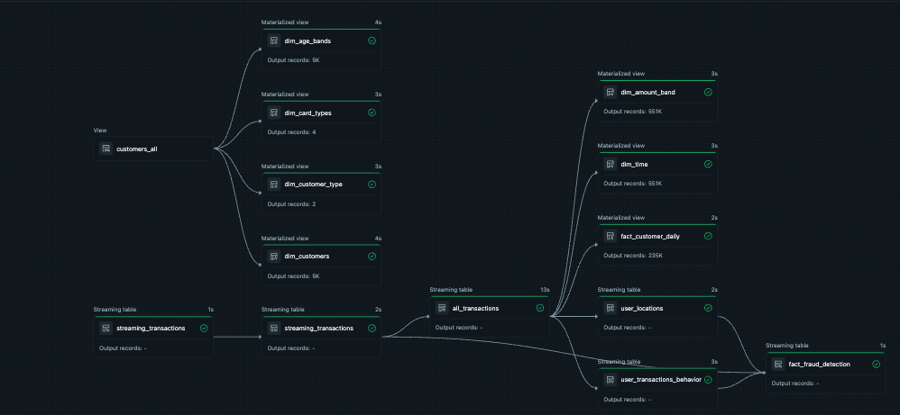

# 🚀 Fraud Detection System (Streaming + Batch | Databricks SDP)

## 📌 Overview
This project implements a **real-time fraud detection system** using a **hybrid streaming + batch architecture** on Databricks **Structured Data Pipelines (SDP)**.

It processes:
- 📥 Historical batch data (transactions)
- ⚡ Real-time streaming data (Event Hubs)

And produces:
- 🧠 Feature-engineered datasets
- 🚨 Real-time fraud scoring
- 📊 Analytics-ready star schema

---

## 🏗️ Architecture



### Data Flow
Batch (CSV / Bronze) ──► Silver ──► All Transactions ──► Features ──► Fraud Detection
▲                     ▲
Streaming (Event Hubs) ───────────────────┘                     │
│
Historical Context (Lagged)

### Layers

- **Bronze**
  - Raw ingestion (batch via notebook)
  - Streaming ingestion (Event Hubs)

- **Silver**
  - Data cleaning, schema enforcement
  - Deduplication

- **Gold**
  - Feature engineering (user behavior, location patterns)
  - Fraud detection (real-time scoring)
  - Star schema (facts + dimensions)

---

## ⚙️ Key Features

### 1. Real-Time Fraud Detection
- Processes streaming transactions instantly
- Generates:
  - `fraud_score`
  - `fraud_flag`

---

### 2. Lag-Based Feature Engineering (Critical)
To avoid **data leakage**, features are computed using **past data only**:

```python
timestamp < current_timestamp() - INTERVAL 10 MINUTES

